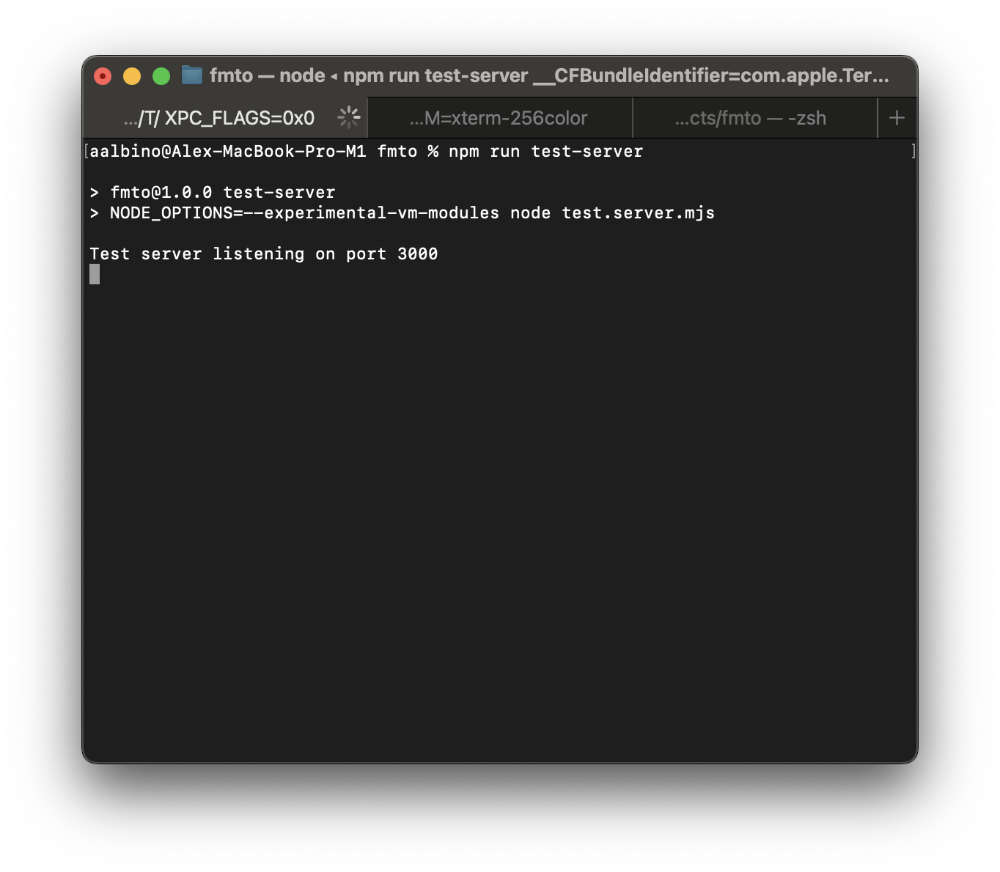
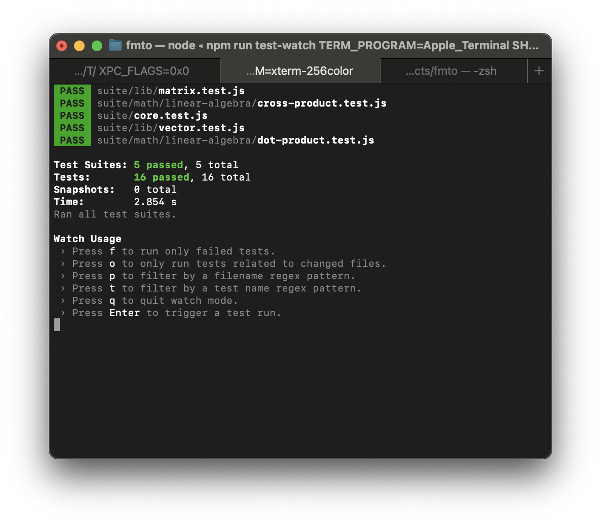

# fmto
FMTO - WebGPU based Math Library


## Objective

This library should implement of Mathematical and Computer Science algorithms that are executed within a machine's GPU via WebGPU.


## WebGPU Arithmetic

See https://www.w3.org/TR/WGSL/#arithmetic-expr

## Run Tests

FMTO leverages Puppeteer and Jest. We run a local test server, and a headless Chrome browser with WebGPU support enabled to run our tests.

First, start the test server:

```
npm run test-server
```



This will start the test server at http://localhost:3000

Next, run the tests once, or watch for changes to re-run tests:

```
# Run once
npm run test
```

```
# Watch for test changes and re-run tests
npm run test-watch
```
